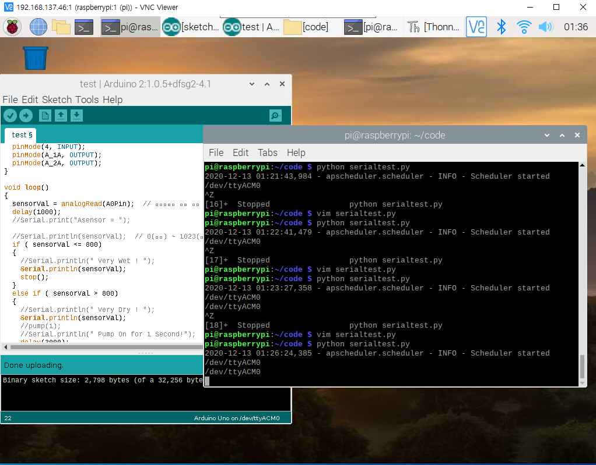

# 무선네트워크 3조 기말 프로젝트
  - 팀명 : 상부삼조
  - 조원 : 양대철(201544090), 임지섭(201644063), 임선주(201644060), 김승연(201644043), 김도은(201844042)
 
## 프로젝트 개요
  - 주제 : 스마트 화분
  - 목표 : 아두이노를 이용하여 물을 자동으로 주는 스마트 화분을 구현하고, 라즈베리파이를 연동하여 텔레그램을 통해 확인 메시지를 전송하는것을 목표로 한다.

## 준비물
  </img>

## S/W 구성도
  </img>

## Arduino
  - 기능
    1. 토양 수분 감지 센서를 통해 토양의 수분을 감지합니다.
    2. 토양 수분의 수치가 일정 값보다 높을 경우 수분이 부족한걸로 판단하여 워터 펌프를 작동합니다.
    3. 워터 펌프를 통해 물을 빨아들인 후, 호스를 따라서 물을 화분에 배출합니다.

  - 코드 : [arduino_code](./Arduino_Code/Finish/sketch_dec12a/sketch_dec12a.ino)

  - 회로도

    </img>
    </img>

  - 유튜브 영상

    - [토양 수분 감지 센서를 이용하여 자동으로 물 주기](https://www.youtube.com/watch?v=x1OLyBYllVw)

## Raspberrypi
  - 기능
    1. 아두이노와 연동하여 토양 수분 감지 센서가 얻은 수치 값을 라즈베리파이로 불러옵니다.
    2. 얻어온 수치 값이 일정 값보다 높을 경우 워터 펌프가 작동되므로, 이 경우에 텔레그램으로 "물을 줍니다." 라고 메시지를 전송합니다.
    3. ~라즈베리파이 카메라를 통해 식물에게 물을 주는 모습도 촬영하여 텔레그램으로 전송합니다.~

  - 코드 : [raspberrypi_code](./Raspberry_Code/Finish/serialtest.py)
  
  - 아두이노&라즈베리파이 연동
    
    </img>
    
  - 라즈베리파이&텔레그램 연동
    
    </img>

  - 유튜브 영상

    - [아두이노와 라즈베리파이를 연동하여 토양의 수분 수치 측정](https://www.youtube.com/watch?v=CxpEPfRKjlw)
    - [라즈베리파이와 텔레그램을 연동하여 메시지 전송](https://www.youtube.com/watch?v=iAftGzbpjgY)
