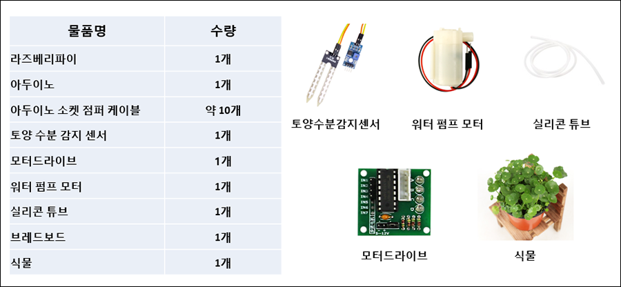
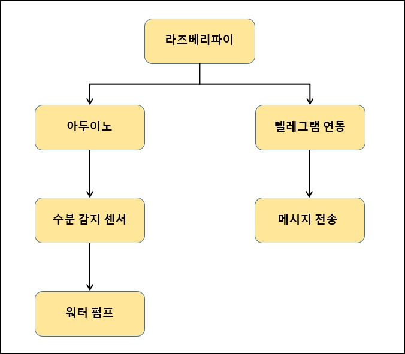

# 무선네트워크 3조 기말 프로젝트
  - 팀명 : 상부삼조
  - 조원 : 양대철(201544090), 임지섭(201644063), 임선주(201644060), 김승연(201644043), 김도은(201844042)
 
## 프로젝트 개요
  - 주제 : 스마트 화분
  - 목표 : 아두이노를 이용하여 물을 자동으로 주는 스마트 화분을 구현하고, 라즈베리파이를 연동하여 텔레그램을 통해 확인 메시지와 사진을 전송하는것을 목표로 한다.

## 준비물
  </img>

## S/W 구성도
  </img>
  
## Arduino
  - 기능
    1. 토양 수분 감지 센서를 통해 토양의 수분을 감지합니다.
    2. 토양 수분의 수치가 일정 값보다 높을 경우 수분이 부족한걸로 판단하여 워터 펌프를 작동합니다.
    3. 워터 펌프를 통해 물을 빨아들인 후, 호스를 따라서 물을 화분에 배출합니다.

  - 코드 : [arduino_code](./Arduino_Code/Finish/sketch_dec12a/sketch_dec12a.ino)
  
  - 회로도
    </img></img>
